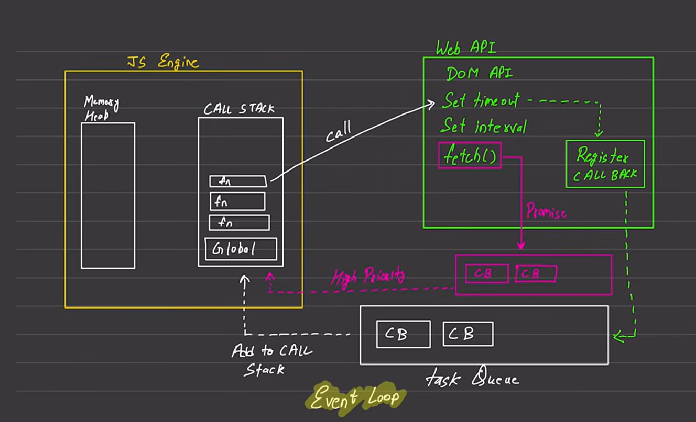

to understand about js how it works with api's or setTimeout's asynchronously watcha vdo no. = 37.
prerequisites = watch prvs vdos of call stack and execution context.

Summary :-
programming ke case mai mathematical calculations easily perform kr skte hai but sabse tough task & time taking task hota hai files ko read krna & usmai se data laana.
OS mai actually hota kya hai ki, file apka program read nahi kr skta usko read krne ke lie apko context dena hota hai kernel ko & wo further file read krta hai and values deta hai program ko wapas through kernel.
this process is too time taking kernel ke pass or bhi kaam hote hai that's why hum file read ya write krwane mai time lag jaata hai.
& JS ke pass browser ke andar power nahi hoti ki wo file ko read kre to wo node ki help leta hai. so file system ka access apko nodejs ke pass hot hai.
that's why hum file ko asynchronously read krte hai.. ye non-blocking code hogaya...
blocking & non-blocking code depend krta hai situation pe kya better hai...

that's why jo humara example hai 1,(setTimeout(2, 0sec)), 3 -> 1,3,2
because the setTimeout will go in the webapi/api/nodeapi box, waha se wo call back box mai register hoga itne mai humara 3 print hojayega.. above image ka ref lelo..